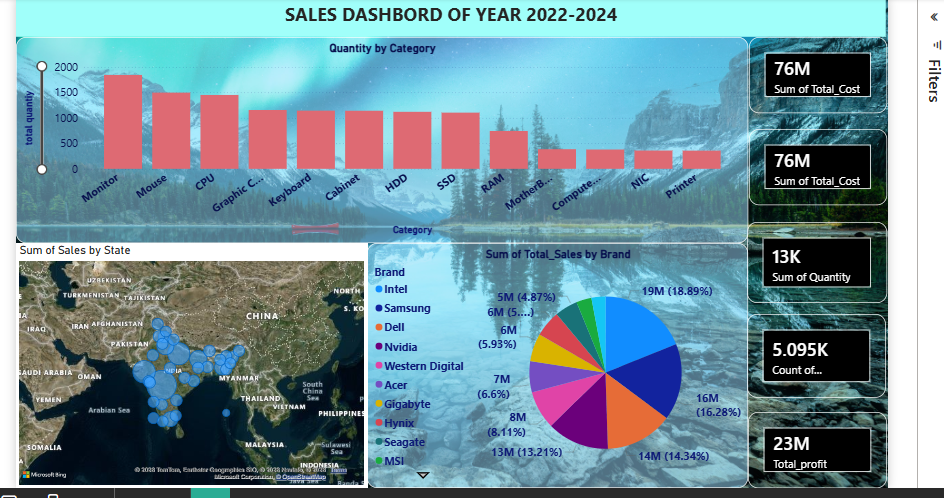

# 📊 Sales Dashboard Analysis (2022–2024)

## 📌 Overview

This project showcases an interactive **Sales Dashboard** developed to analyze business performance from **2022 to 2024**.
It provides insights into sales trends, product demand, brand contribution, and regional distribution to support data-driven decision-making.

---

## 🎯 Objectives

* Monitor overall sales, profit, and quantity
* Identify top-performing product categories
* Analyze brand-wise sales contribution
* Understand geographical sales distribution
* Support strategic business decisions

---

## 🛠️ Tools & Technologies

* **Power BI** – Data visualization & dashboard creation
* **SQL** – Data querying & transformation
* **Microsoft Excel** – Data cleaning & preprocessing

---

## 📊 Key Features

### 🔹 KPI Metrics

* **Total Sales**: 76M
* **Total Cost**: 76M
* **Total Quantity**: 13K
* **Total Profit**: 23M

### 🔹 Category Analysis

* Visual representation of quantity sold across categories
* Helps identify high-demand products like Monitor, Mouse, and CPU

### 🔹 Brand Analysis

* Pie chart showing contribution by brands such as Intel, Samsung, Dell, Nvidia, etc.
* Enables comparison of brand performance

### 🔹 Regional Analysis

* Map visualization displaying sales distribution across different states in India
* Identifies high-performing regions

---

## 📷 Dashboard Preview



---

## 🔍 Key Insights

* Monitors and Mouse are among the most sold products
* Leading brands like Intel and Samsung contribute significantly to sales
* Certain regions generate higher revenue compared to others
* Sales and cost are balanced, indicating stable pricing strategy

---

## 🚀 Business Impact

* Improves product demand understanding
* Supports better inventory and supply planning
* Enables targeted marketing strategies
* Enhances decision-making with clear visual insights

---

## 📂 Project Structure

```
Sales-Dashboard/
│── sales dashboard.pbix
│── dataset.csv
│── sales dashboard.png
│── README.md
```

---

## 👨‍💻 Author

**vaibhav ojha**
Skills: Power BI | SQL | Excel | Data Analytics

---

## ⭐ Conclusion

This dashboard provides a comprehensive and interactive view of sales performance, helping stakeholders quickly identify trends, optimize strategies, and make informed business decisions.


